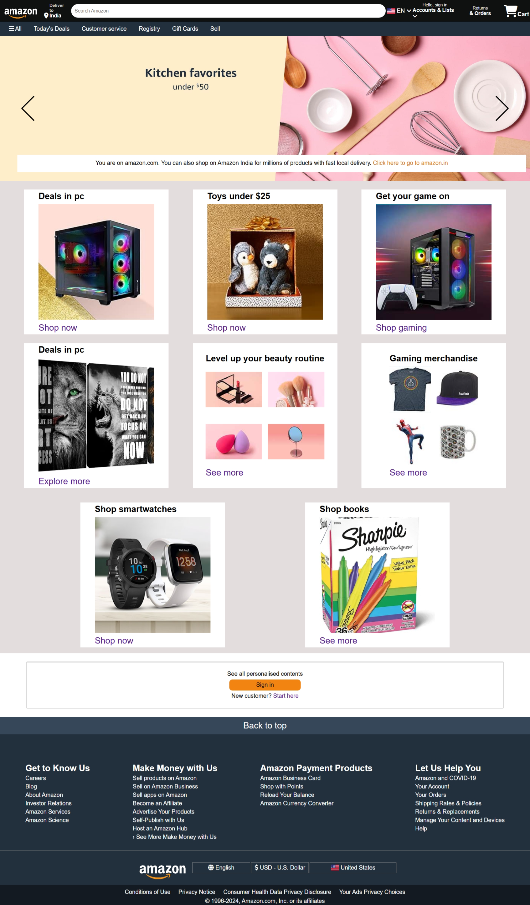

# Amazon Homepage Clone

This project is a static clone of the Amazon homepage, built using HTML, CSS, and JavaScript. It aims to replicate the visual design and core interactive elements of the Amazon front page, including the navigation bar, product displays, and an image slider.

---

## Project Preview

---

## Amazon Clone Video Demo

Here is an animated demonstration of the website's features and interactivity.

**➡️ [Watch the full video demo (MP4)](./assets/amazon-clone-demo.mp4)**

---

## Features

-   **Detailed Header:** Includes the Amazon logo, delivery location, a functional search bar with a category dropdown, language selection, account links, and a cart icon.
-   **Two-Tier Navigation:** A main navigation bar and a secondary menu bar for categories like "Today's Deals" and "Customer Service".
-   **Interactive Image Slider:**
    -   Automatically cycles through a set of hero images.
    -   Manual navigation with "Previous" and "Next" buttons.
    -   The automatic slideshow pauses when the user hovers over it.
-   **Product Grid:** A responsive grid layout showcasing various product categories using both Flexbox and CSS Grid.
-   **Comprehensive Footer:** A multi-section footer with links, language/currency settings, and copyright information, mimicking the real site.
-   **Hover Effects:** Interactive hover effects on links and navigation items to improve user experience.

---

## Technologies Used

-   **HTML5:** For the structure and content of the web page.
-   **CSS3:** For styling, layout, and animations.
    -   **Flexbox:** Used for aligning items in the navigation bar and product boxes.
    -   **CSS Grid:** Used for complex layouts in specific product boxes.
-   **JavaScript:** For dynamic functionality, primarily the image slider.
